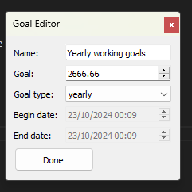

# Goal tracker is for keeping track of your working hours and your goals

Goal tracker is a desktop widget that allows you set daily, monthly, or etc. goals with custom filters. It depends on activity watch as it gets the date from it. Every goal you create has some activity watch filters to that basically specify how you measure the progress of your goal.

## Requirements
- Python3
- [Activity Watch](https://activitywatch.net/downloads/) needs to be installed as the app gets the data from it. 
- Ui is developed with PyQt5 so it needs to be installed. ```pip install PyQt5```

## Usage:

`pythonw` starts the app in the background with the following command.

```
pythonw -m goaltracker
```

## UI previews



